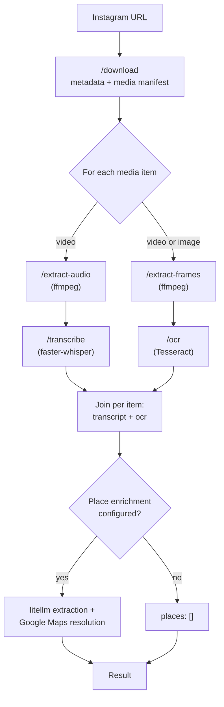
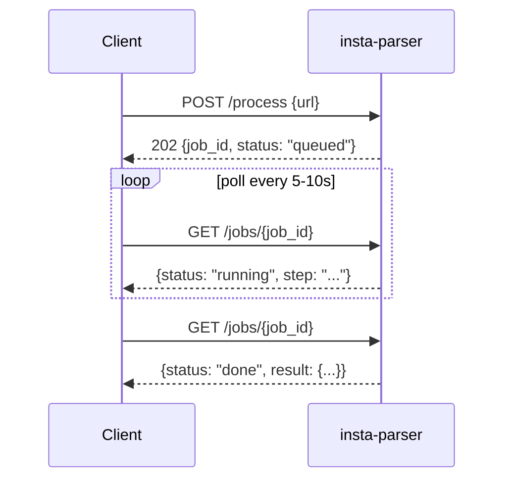

# insta-parser

## Overview

`insta-parser` turns an Instagram post URL — a reel, a single image, or a
carousel of either — into structured text: post metadata, a spoken-audio
transcript for every video, and OCR of on-screen text for every image and
video, each attributed back to the specific item it came from. It can also
optionally extract real-world places (restaurants, landmarks, cities)
mentioned in a post and resolve them to a rating and Maps link.

It's a small, self-hosted FastAPI service — plain JSON over HTTP, no
authentication, no SDK, no CLI. Built to be called from n8n workflows, LLM
agents, or any script that can make an HTTP request.

If you're calling this from an agent, see
[`skills/insta-parser/`](skills/insta-parser/) — `SKILL.md` covers calling
the service, `reference/operations.md` covers running and tuning it.

## How it works

Each request to `/download` creates a `job_id` with its own folder, and every
step after that operates **per media item**: a plain reel or single photo is
one item (index 1), a carousel is N items in post order. Video items get
audio extraction and transcription; every item — video or image — gets frame
extraction and OCR. An optional final step extracts and resolves place
mentions across the whole post.



`/process` runs this whole pipeline for you, but it's asynchronous — whisper
transcription alone can run for minutes, well past a normal HTTP timeout — so
it queues the job and returns immediately. You poll `GET /jobs/{job_id}`
until it reaches a terminal status:



If you only need one piece of the pipeline, or need to skip a step (e.g. a
silent reel where transcription is wasted work), the per-step endpoints let
you call `/download`, `/extract-audio`, `/transcribe`, `/extract-frames`, and
`/ocr` independently and synchronously — see [Usage](#usage) below.

## Setup

**Prerequisites:** Docker. `ffmpeg` and `tesseract` are bundled in the image
— nothing to install on the host.

### Running

From the published image:

```bash
docker run -d --name insta-parser -p 8420:8000 \
  -v ${HOME}/volumes/insta-parser/data:/data \
  -e TZ=Europe/Amsterdam \
  ghcr.io/thehaseebahmed/insta-parser:main
```

`:main` tracks the latest commit on `main`. Image tags follow semver
(`:X.Y.Z`) for stable deployments — there is no `:latest` tag.

Or point a `docker-compose.yaml`'s `image:` at
`ghcr.io/thehaseebahmed/insta-parser:<version>` — see this repo's own
[`docker-compose.yaml`](docker-compose.yaml) for the env var layout (it
builds locally for development; swap `build:` for a pinned `image:` for
deployment):

```bash
docker compose up -d --build
docker compose logs -f
```

The service listens on `8000` inside the container. It's deliberately not
exposed via a reverse proxy or Tailscale by default — there's no auth on it.

### Configuration (env vars)

| Var | Default | Notes |
|---|---|---|
| `WORK_DIR` | `/data` | Root dir for per-job files, mount as a volume |
| `IG_USERNAME` | unset | Instagram username for an authenticated session |
| `IG_SESSION_FILE` | unset | Path to an instaloader session file (see below) |
| `KEEP_FILES` | `false` | Keep job files after `/process` finishes |
| `JOB_TTL_HOURS` | `24` | Job folders older than this are swept on startup and hourly |
| `WHISPER_MODEL` | `base` | faster-whisper model size (`tiny`, `base`, `small`, ...) |
| `WHISPER_DEVICE` | `cpu` | faster-whisper device |
| `WHISPER_COMPUTE_TYPE` | `int8` | faster-whisper compute type |
| `WHISPER_VAD_FILTER` | `true` | Skip non-speech audio (silence, music, ASMR mouth sounds) via Silero VAD before decoding, to avoid whisper hallucinating text on those stretches |
| `TRANSCRIBE_CONCURRENCY` | `1` | How many transcriptions may run at once |
| `FFMPEG_TIMEOUT` | `300` | Per-invocation ffmpeg timeout, seconds |
| `MAX_FRAMES` | `60` | Cap on extracted frames per video item (each image item always contributes exactly 1) |
| `FRAME_SCALE_HEIGHT` | `720` | Frames are downscaled to this height before OCR |
| `SCENE_THRESHOLD` | `0.3` | ffmpeg scene-change sensitivity (higher = fewer frames) |
| `OCR_DEDUPE_THRESHOLD` | `90` | rapidfuzz similarity (0-100) above which consecutive OCR text is dropped as a duplicate |
| `OCR_MIN_CONFIDENCE` | `50` | Mean per-word Tesseract confidence (0-100) below which an OCR result is dropped as noise |
| `LOG_LEVEL` | `INFO` | Python logging level |
| `LITELLM_BASE_URL` | unset | Base URL of a litellm proxy, **without** a `/v1` suffix (e.g. `http://172.17.0.1:4000`) |
| `LITELLM_API_KEY` | unset | Bearer key for the litellm proxy, if it requires one |
| `LITELLM_MODEL` | unset | Model alias already registered in litellm (e.g. a local Ollama model) to use for place extraction |
| `LITELLM_TIMEOUT` | `60` | Timeout (seconds) for the litellm extraction call |
| `PLACE_EXTRACTION_MAX_CHARS` | `4000` | How much combined caption/transcript/OCR text to send to the model |
| `GOOGLE_MAPS_API_KEY` | unset | Google Maps Places API (New) key, used to resolve extracted places to a rating + Maps URL |
| `GOOGLE_MAPS_TIMEOUT` | `10` | Timeout (seconds) for each Places API lookup |

Place-metadata enrichment (`LITELLM_*` and `GOOGLE_MAPS_*`) is optional and
made of two independent pieces — see [Interpreting the
output](#interpreting-the-output) below for how it behaves when left unset.

### Optional authenticated Instagram session

Anonymous access works for public posts but is more likely to get
rate-limited. To use a logged-in session:

```bash
pip install instaloader
instaloader --login=<your_ig_username>
# creates ~/.config/instaloader/session-<your_ig_username>
```

Copy that session file into the `WORK_DIR` volume (so it persists) and set:

```yaml
environment:
    IG_USERNAME: "your_ig_username"
    IG_SESSION_FILE: "/data/session-your_ig_username"
```

## Usage

| Method | Path | Notes |
|---|---|---|
| `GET` | `/health` | Health check |
| `POST` | `/download` | Fetch a post and download its media (video, image, or carousel). Synchronous. |
| `POST` | `/extract-audio` | Extract mp3 audio from each video item (`[]` if the post has none) |
| `POST` | `/transcribe` | Transcribe each video item's audio with faster-whisper |
| `POST` | `/extract-frames` | Grab OCR-ready frames per item: scene-change PNGs for video, one PNG for an image |
| `POST` | `/ocr` | OCR each item's extracted frames, deduping near-identical results within that item |
| `POST` | `/process` | **Async.** Queues the full pipeline, returns `202` + a `job_id`. Includes place-metadata enrichment (optional) |
| `GET` | `/jobs/{job_id}` | Status/result of a `/process` run |
| `DELETE` | `/jobs/{job_id}` | Delete a job's files |

The per-step endpoints are synchronous — each finishes well inside a normal
HTTP timeout. Prefer `/process` unless you specifically need to skip work.

Interactive API docs are served by FastAPI directly from the same request/
response models used above: Swagger UI at `/docs` (try requests against a
running instance right from the browser), ReDoc at `/redoc`, and the raw
OpenAPI schema at `/openapi.json`.

### All-in-one (async)

```bash
BASE=http://localhost:8420

# Queue the job — returns immediately with 202
curl -sX POST $BASE/process \
  -H 'Content-Type: application/json' \
  -d '{"url": "https://www.instagram.com/reel/ABC123xyz/"}'
# => {"job_id": "3f1c...", "status": "queued"}

# Poll until status is "done" (or "error")
curl -s $BASE/jobs/3f1c...
# => {"job_id":"3f1c...","status":"running","step":"transcribe","result":null,"error":null}
# => {"job_id":"3f1c...","status":"done","step":null,"result":{
#     "metadata":{"username":"...", ...},
#     "media":[{"index":1,"type":"video",
#               "transcript":{"text":"...","segments":[...],"language":"en"},
#               "ocr":[{"text":"...","confidence":92.4}]}],
#     "places":[{"name":"Joe's Pizza","city":"Rome","country":"Italy","rating":4.6,
#                "maps_url":"https://maps.google.com/?cid=..."}]},"error":null}
```

A carousel returns one entry per item in `result.media`, in post order, each
with its own `transcript` (`null` for an image item) and `ocr`.

In n8n: an HTTP Request node for `POST /process`, then a Wait node, then an
HTTP Request node for `GET /jobs/{{ $json.job_id }}` in a loop with an IF node
checking `status == "done"`.

### Step by step (synchronous)

```bash
# 1. Download
curl -sX POST $BASE/download \
  -H 'Content-Type: application/json' \
  -d '{"url": "https://www.instagram.com/reel/ABC123xyz/"}'
# => {"job_id": "...", "metadata": {"username": "...", "caption": "...", "timestamp": "...", ...},
#     "media": [{"index": 1, "type": "video", "path": "/data/.../media_01.mp4"}]}

JOB_ID=<job_id from above>

# 2. Extract audio
curl -sX POST $BASE/extract-audio \
  -H 'Content-Type: application/json' \
  -d "{\"job_id\": \"$JOB_ID\"}"

# 3. Transcribe
curl -sX POST $BASE/transcribe \
  -H 'Content-Type: application/json' \
  -d "{\"job_id\": \"$JOB_ID\"}"

# 4. Extract frames
curl -sX POST $BASE/extract-frames \
  -H 'Content-Type: application/json' \
  -d "{\"job_id\": \"$JOB_ID\"}"

# 5. OCR
curl -sX POST $BASE/ocr \
  -H 'Content-Type: application/json' \
  -d "{\"job_id\": \"$JOB_ID\"}"

# 6. Clean up when the workflow is done with it
curl -sX DELETE $BASE/jobs/$JOB_ID
# => {"job_id": "...", "status": "deleted"}
```

Place-metadata enrichment only runs as part of `/process` — there's no
per-step endpoint for it.

### Interpreting the output

- **Job state is in memory.** A container restart loses the status of any
  in-flight or completed `/process` run (the files on the volume survive).
  Fine for a homelab tool; don't build a long-running workflow that assumes
  otherwise. Finished job records are evicted after `JOB_TTL_HOURS`, so
  fetch a result before then.
- **Cleanup.** `/process` deletes its job folder when it finishes unless
  `KEEP_FILES=true`. The per-step endpoints don't, so either call
  `DELETE /jobs/{job_id}` at the end of your workflow or let the
  `JOB_TTL_HOURS` sweep collect them.
- **Response paths.** `/process` never returns on-disk paths — `result.media`
  has no `path`, and its OCR entries have no `frame` — regardless of
  `KEEP_FILES`; use the per-step endpoints for a real path to a file that's
  still on disk.
- **Concurrency.** Each in-flight `/process` run holds one of FastAPI's
  threadpool workers, and `TRANSCRIBE_CONCURRENCY` (default 1) queues the
  whisper step so parallel jobs don't thrash the CPU. `/health` and
  `GET /jobs/{job_id}` are async, so polling stays responsive no matter how
  many pipelines are running.
- **Error codes.** `400` = bad input (unparseable URL, malformed `job_id`),
  `404` = unknown `job_id`, `422` = a step ran out of order (e.g. `/ocr`
  before `/extract-frames`), `502` = Instagram fetch failed (rate-limited,
  private, or removed post). Errors are also logged with the `job_id` and
  step, visible via `docker logs`.
- **`result.places`** is optional enrichment: a local model (via litellm)
  extracts place mentions from the caption, tagged location, and every
  item's transcript/OCR text, then Google Maps resolves each one to a rating
  and canonical Maps URL. It's always a list; if `LITELLM_MODEL` isn't set,
  extraction doesn't run and `places` comes back `[]`. If `GOOGLE_MAPS_API_KEY`
  isn't set, extracted places still come back but with `rating`/`maps_url`
  as `null`. A failed litellm or Maps call is logged and treated the same as
  unconfigured — it never fails `/process`. Since `[]` means both "not
  configured" and "configured, found nothing," don't treat an empty `places`
  as proof the post has none — see the
  [`insta-parser` skill](skills/insta-parser/SKILL.md) for how to read it.
